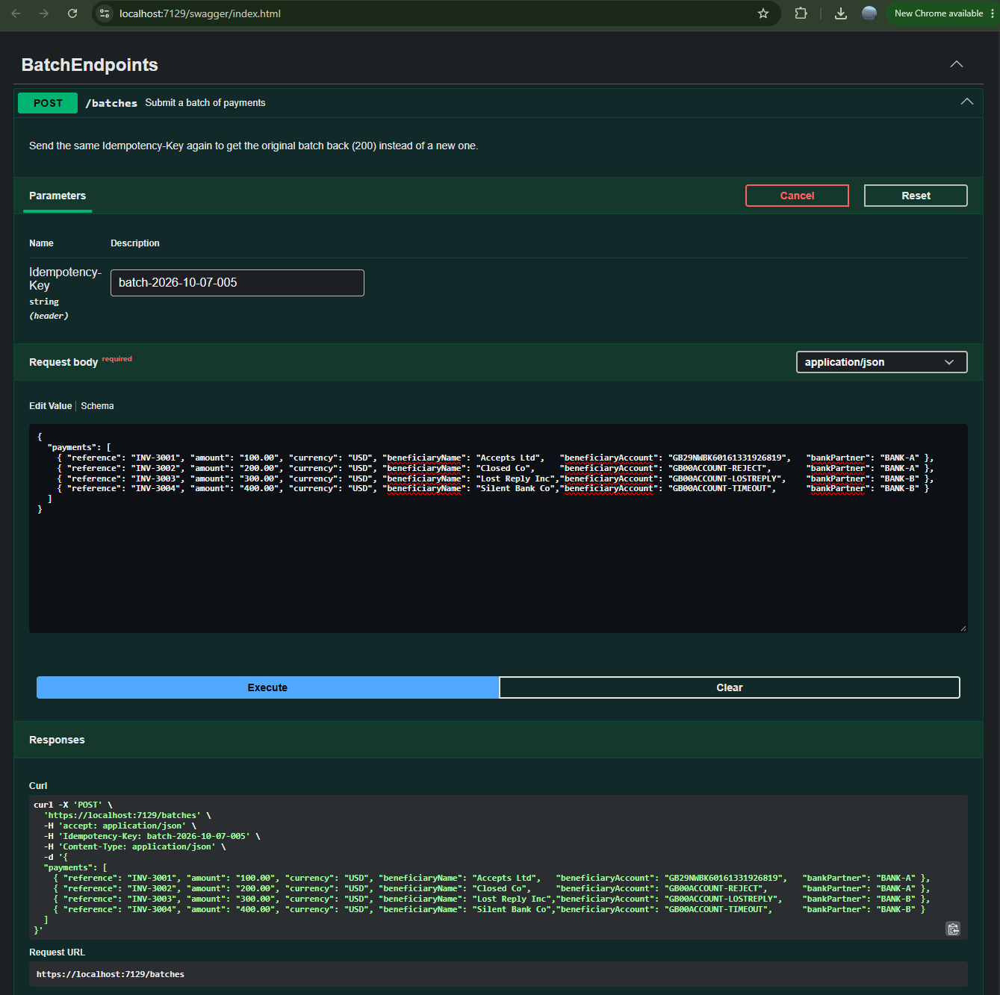
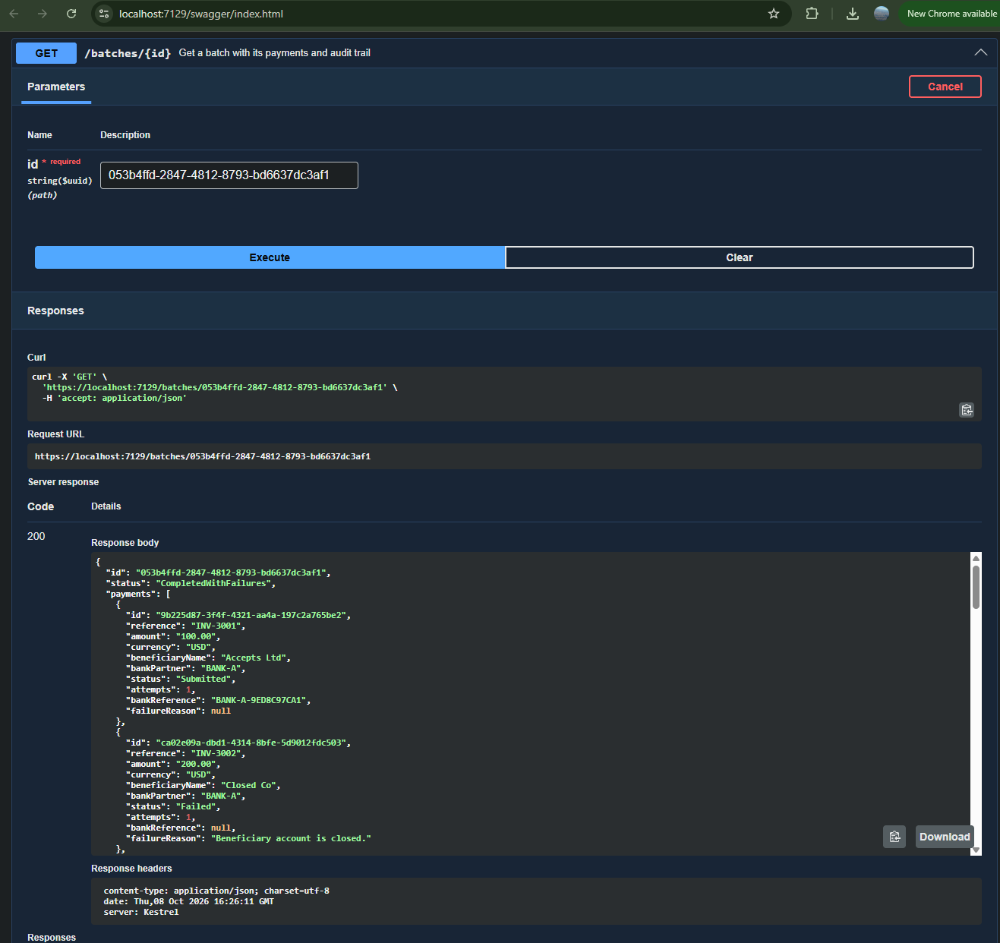

# Payment Batch Service

Accepts batches of outbound payments from corporate treasury teams, validates them, sends each payment to its bank, and tracks every payment to a final outcome with a full audit trail.

- **Design and decisions:** [docs/ARCHITECTURE.md](docs/ARCHITECTURE.md)
- **Work items delivered and future work:** [docs/BACKLOG.md](docs/BACKLOG.md)

## How I used AI

I used AI (Claude) as an assisting tool, a helping hand alongside me. **I set how the work was planned and run, and the design decisions and trade-offs are mine.**

**How I directed the planning**
- I asked for a plan before any code was written, and for the brief to be followed exactly.
- I had the work broken into Jira-style stories ([BACKLOG.md](docs/BACKLOG.md)), each built, tested and committed on its own, so the git history follows the backlog one story at a time.
- I cut the scope to fit the 4-6 hour guideline, with the rest documented as numbered future work.
- I asked for the code to stay simple and minimal, with no shortcuts and no speculative fields.
- The backlog shows where my decisions changed the plan: **PAY-16 (Stateless NuGet package)** and **PAY-17 (Swagger)** have higher numbers because I added them mid-sprint.

**How the AI helped**
- For each story, Claude drafted the code, tests or docs, and laid out options with their trade-offs when there was a choice to make.
- I reviewed every draft, chose or overruled the options, ran the tests and made each commit myself.

**Decisions I made**
- **Stateless NuGet package for the payment state machine** (PAY-16). I have used it before. Claude's first draft used hand-written transition checks without a state machine concept.
- **EF Core** for persistence, and **`Currency` as a record** so both value types follow one rule.
- **Minimal domain models.** I pushed back twice on over-modelling, and removed fields that nothing used yet. A field is added in the commit that first needs it.
- **HTTP intake now, file drop documented.**
- **The worker stays in the API process.** I made this call knowing the trade-off with SQLite being a single physical file; it is written up as ADR-7.
- I raised **event-driven processing** and a **separate worker service** as design questions; both are documented as the production path.
- I asked for **Swagger** (PAY-17), and decided an **operations UI** (status dashboard and search) belongs in future work rather than in this slice.
- An idempotency key enforced by a unique index. So, even if payment details are different and idempotency keys match, the payment will not be tried.

**Options Claude proposed that I reviewed and accepted**
- Whole-batch validation.
- Timeout → retry with the same key → NeedsReview (never Failed).
- SQLite for zero-setup runs, with in-memory SQLite for tests.

## Run it

Requires the **.NET 10 SDK**. No database or other services to install: the app creates a SQLite file (`payments.db`) on first run.

```bash
dotnet build
dotnet test
dotnet run --project src/PaymentService.Api
```

- API: `http://localhost:5238`
- Swagger UI: `http://localhost:5238/swagger` (opens automatically when you press F5 in Visual Studio)
- Ready-made requests: `src/PaymentService.Api/PaymentService.Api.http` (Visual Studio or VS Code REST Client)

To start with an empty database, stop the app and delete `src/PaymentService.Api/payments.db`.

## Try it

A real run on my machine, using **"Batch showing every outcome"** from the `.http` file. The simulated bank decides each payment's outcome from the end of the beneficiary account number.

**1. Submit the batch: `POST /batches`** with an `Idempotency-Key` header. It returns **201**, with every payment Pending.



<details>
<summary>Full POST response (201): batch <code>Processing</code>, all four payments Pending</summary>

```json
{
  "id": "053b4ffd-2847-4812-8793-bd6637dc3af1",
  "status": "Processing",
  "payments": [
    {
      "id": "9b225d87-3f4f-4321-aa4a-197c2a765be2",
      "reference": "INV-3001",
      "amount": "100.00",
      "currency": "USD",
      "beneficiaryName": "Accepts Ltd",
      "bankPartner": "BANK-A",
      "status": "Pending",
      "attempts": 0,
      "bankReference": null,
      "failureReason": null
    },
    {
      "id": "ca02e09a-dbd1-4314-8bfe-5d9012fdc503",
      "reference": "INV-3002",
      "amount": "200.00",
      "currency": "USD",
      "beneficiaryName": "Closed Co",
      "bankPartner": "BANK-A",
      "status": "Pending",
      "attempts": 0,
      "bankReference": null,
      "failureReason": null
    },
    {
      "id": "7709ed31-e0c6-4cf4-b907-a1e577c7bad7",
      "reference": "INV-3003",
      "amount": "300.00",
      "currency": "USD",
      "beneficiaryName": "Lost Reply Inc",
      "bankPartner": "BANK-B",
      "status": "Pending",
      "attempts": 0,
      "bankReference": null,
      "failureReason": null
    },
    {
      "id": "6aa2b46b-dd22-462b-a6f1-a2fd54308458",
      "reference": "INV-3004",
      "amount": "400.00",
      "currency": "USD",
      "beneficiaryName": "Silent Bank Co",
      "bankPartner": "BANK-B",
      "status": "Pending",
      "attempts": 0,
      "bankReference": null,
      "failureReason": null
    }
  ],
  "auditTrail": [
    {
      "paymentId": "9b225d87-3f4f-4321-aa4a-197c2a765be2",
      "fromStatus": null,
      "toStatus": "Pending",
      "note": null,
      "occurredAt": "2026-10-08T16:22:40.3802+00:00"
    },
    {
      "paymentId": "ca02e09a-dbd1-4314-8bfe-5d9012fdc503",
      "fromStatus": null,
      "toStatus": "Pending",
      "note": null,
      "occurredAt": "2026-10-08T16:22:40.3802+00:00"
    },
    {
      "paymentId": "7709ed31-e0c6-4cf4-b907-a1e577c7bad7",
      "fromStatus": null,
      "toStatus": "Pending",
      "note": null,
      "occurredAt": "2026-10-08T16:22:40.3802+00:00"
    },
    {
      "paymentId": "6aa2b46b-dd22-462b-a6f1-a2fd54308458",
      "fromStatus": null,
      "toStatus": "Pending",
      "note": null,
      "occurredAt": "2026-10-08T16:22:40.3802+00:00"
    }
  ]
}
```

</details>

**2. Check the batch: `GET /batches/{id}`** using the `id` from the 201 response, about 10 seconds later.



<details>
<summary>Full GET response (200): batch <code>CompletedWithFailures</code>, all four payments and the audit trail</summary>

```json
{
  "id": "053b4ffd-2847-4812-8793-bd6637dc3af1",
  "status": "CompletedWithFailures",
  "payments": [
    {
      "id": "9b225d87-3f4f-4321-aa4a-197c2a765be2",
      "reference": "INV-3001",
      "amount": "100.00",
      "currency": "USD",
      "beneficiaryName": "Accepts Ltd",
      "bankPartner": "BANK-A",
      "status": "Submitted",
      "attempts": 1,
      "bankReference": "BANK-A-9ED8C97CA1",
      "failureReason": null
    },
    {
      "id": "ca02e09a-dbd1-4314-8bfe-5d9012fdc503",
      "reference": "INV-3002",
      "amount": "200.00",
      "currency": "USD",
      "beneficiaryName": "Closed Co",
      "bankPartner": "BANK-A",
      "status": "Failed",
      "attempts": 1,
      "bankReference": null,
      "failureReason": "Beneficiary account is closed."
    },
    {
      "id": "7709ed31-e0c6-4cf4-b907-a1e577c7bad7",
      "reference": "INV-3003",
      "amount": "300.00",
      "currency": "USD",
      "beneficiaryName": "Lost Reply Inc",
      "bankPartner": "BANK-B",
      "status": "Submitted",
      "attempts": 2,
      "bankReference": "BANK-B-F95770CBE0",
      "failureReason": null
    },
    {
      "id": "6aa2b46b-dd22-462b-a6f1-a2fd54308458",
      "reference": "INV-3004",
      "amount": "400.00",
      "currency": "USD",
      "beneficiaryName": "Silent Bank Co",
      "bankPartner": "BANK-B",
      "status": "NeedsReview",
      "attempts": 3,
      "bankReference": null,
      "failureReason": "No reliable response from bank: Bank did not respond. (gave up after 3 attempts)"
    }
  ],
  "auditTrail": [
    {
      "paymentId": "9b225d87-3f4f-4321-aa4a-197c2a765be2",
      "fromStatus": null,
      "toStatus": "Pending",
      "note": null,
      "occurredAt": "2026-10-08T16:22:40.3802+00:00"
    },
    {
      "paymentId": "ca02e09a-dbd1-4314-8bfe-5d9012fdc503",
      "fromStatus": null,
      "toStatus": "Pending",
      "note": null,
      "occurredAt": "2026-10-08T16:22:40.3802+00:00"
    },
    {
      "paymentId": "7709ed31-e0c6-4cf4-b907-a1e577c7bad7",
      "fromStatus": null,
      "toStatus": "Pending",
      "note": null,
      "occurredAt": "2026-10-08T16:22:40.3802+00:00"
    },
    {
      "paymentId": "6aa2b46b-dd22-462b-a6f1-a2fd54308458",
      "fromStatus": null,
      "toStatus": "Pending",
      "note": null,
      "occurredAt": "2026-10-08T16:22:40.3802+00:00"
    },
    {
      "paymentId": "6aa2b46b-dd22-462b-a6f1-a2fd54308458",
      "fromStatus": "Pending",
      "toStatus": "Dispatching",
      "note": "Attempt 1",
      "occurredAt": "2026-10-08T16:22:42.2672+00:00"
    },
    {
      "paymentId": "6aa2b46b-dd22-462b-a6f1-a2fd54308458",
      "fromStatus": "Dispatching",
      "toStatus": "Pending",
      "note": "No reliable response from bank: Bank did not respond.",
      "occurredAt": "2026-10-08T16:22:42.5107+00:00"
    },
    {
      "paymentId": "7709ed31-e0c6-4cf4-b907-a1e577c7bad7",
      "fromStatus": "Pending",
      "toStatus": "Dispatching",
      "note": "Attempt 1",
      "occurredAt": "2026-10-08T16:22:42.5169+00:00"
    },
    {
      "paymentId": "7709ed31-e0c6-4cf4-b907-a1e577c7bad7",
      "fromStatus": "Dispatching",
      "toStatus": "Pending",
      "note": "No reliable response from bank: Bank accepted the payment but the reply was lost.",
      "occurredAt": "2026-10-08T16:22:42.7298+00:00"
    },
    {
      "paymentId": "9b225d87-3f4f-4321-aa4a-197c2a765be2",
      "fromStatus": "Pending",
      "toStatus": "Dispatching",
      "note": "Attempt 1",
      "occurredAt": "2026-10-08T16:22:42.7341+00:00"
    },
    {
      "paymentId": "9b225d87-3f4f-4321-aa4a-197c2a765be2",
      "fromStatus": "Dispatching",
      "toStatus": "Submitted",
      "note": "Bank reference BANK-A-9ED8C97CA1",
      "occurredAt": "2026-10-08T16:22:42.9466+00:00"
    },
    {
      "paymentId": "ca02e09a-dbd1-4314-8bfe-5d9012fdc503",
      "fromStatus": "Pending",
      "toStatus": "Dispatching",
      "note": "Attempt 1",
      "occurredAt": "2026-10-08T16:22:42.951+00:00"
    },
    {
      "paymentId": "ca02e09a-dbd1-4314-8bfe-5d9012fdc503",
      "fromStatus": "Dispatching",
      "toStatus": "Failed",
      "note": "Beneficiary account is closed.",
      "occurredAt": "2026-10-08T16:22:43.1625+00:00"
    },
    {
      "paymentId": "6aa2b46b-dd22-462b-a6f1-a2fd54308458",
      "fromStatus": "Pending",
      "toStatus": "Dispatching",
      "note": "Attempt 2",
      "occurredAt": "2026-10-08T16:22:44.2536+00:00"
    },
    {
      "paymentId": "6aa2b46b-dd22-462b-a6f1-a2fd54308458",
      "fromStatus": "Dispatching",
      "toStatus": "Pending",
      "note": "No reliable response from bank: Bank did not respond.",
      "occurredAt": "2026-10-08T16:22:44.46+00:00"
    },
    {
      "paymentId": "7709ed31-e0c6-4cf4-b907-a1e577c7bad7",
      "fromStatus": "Pending",
      "toStatus": "Dispatching",
      "note": "Attempt 2",
      "occurredAt": "2026-10-08T16:22:44.4637+00:00"
    },
    {
      "paymentId": "7709ed31-e0c6-4cf4-b907-a1e577c7bad7",
      "fromStatus": "Dispatching",
      "toStatus": "Submitted",
      "note": "Bank reference BANK-B-F95770CBE0",
      "occurredAt": "2026-10-08T16:22:44.6632+00:00"
    },
    {
      "paymentId": "6aa2b46b-dd22-462b-a6f1-a2fd54308458",
      "fromStatus": "Pending",
      "toStatus": "Dispatching",
      "note": "Attempt 3",
      "occurredAt": "2026-10-08T16:22:46.268+00:00"
    },
    {
      "paymentId": "6aa2b46b-dd22-462b-a6f1-a2fd54308458",
      "fromStatus": "Dispatching",
      "toStatus": "NeedsReview",
      "note": "No reliable response from bank: Bank did not respond. (gave up after 3 attempts)",
      "occurredAt": "2026-10-08T16:22:46.476+00:00"
    }
  ]
}
```

</details>

**3. What happened to each payment**

| Payment | Beneficiary account ends in | Simulated bank | Final status |
|---|---|---|---|
| INV-3001 | (anything else) | accepts | **Submitted** |
| INV-3002 | `REJECT` | rejects | **Failed** |
| INV-3003 | `LOSTREPLY` | accepts but the reply is lost | **Submitted** after a safe retry (executed once) |
| INV-3004 | `TIMEOUT` | never answers | **NeedsReview** after 3 attempts |

The `auditTrail` shows every status change with its reason. Sending the same request again with the same `Idempotency-Key` returns the original batch (200) instead of creating a new one.

## API

| Endpoint | Purpose |
|---|---|
| `POST /batches` | Submit a batch. Requires the `Idempotency-Key` header. Returns **201** (created), **200** (same key seen before: original batch) or **400** (every validation problem, nothing saved). |
| `GET /batches/{id}` | Batch status, payments and audit trail. **404** if not found. |

Amounts are JSON strings (`"1250.50"`), never numbers.

## Tests

```bash
dotnet test
```

60 tests:
- domain (money, state machine, batch rules)
- persistence against real SQLite in memory
- batch submission (idempotency, validation)
- dispatch (every bank outcome, no double payment after a lost reply, audit trail saved)

## Project layout

| Project | Contents |
|---|---|
| `src/PaymentService.Core` | Domain model, state machine (Stateless NuGet package), validation, submission and dispatch logic, interfaces |
| `src/PaymentService.Infrastructure` | EF Core + SQLite repositories, simulated bank |
| `src/PaymentService.Api` | Minimal API endpoints, background dispatch worker, Swagger |
| `tests/PaymentService.Tests` | xUnit tests |

## Assumptions

- A single instance runs at a time. The SQLite file is local to the process, and dispatch assumes one worker.
- No authentication (see the architecture doc for how it would be added).
- All times are UTC. Payments are sent as soon as they are accepted (no cut-off times or future dates).
- A batch holds 1-1,000 payments and is accepted whole or not at all.
- Supported currencies: USD, EUR, GBP, CHF, CAD, SGD, INR, JPY, BHD.
- **Submitted** means the bank accepted the instruction, not that the money has settled.
- The simulated bank remembers idempotency keys in memory only, so it resets on restart.

