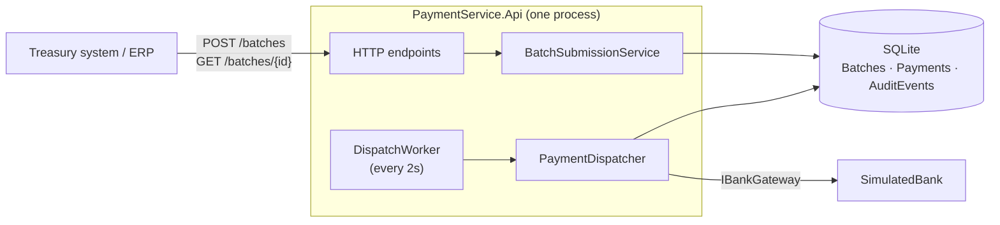
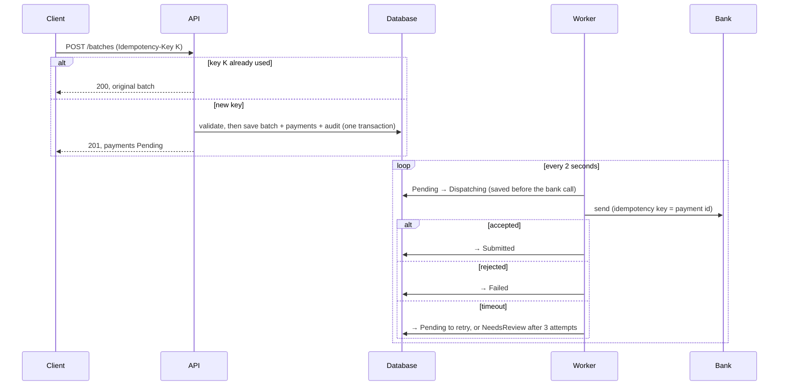
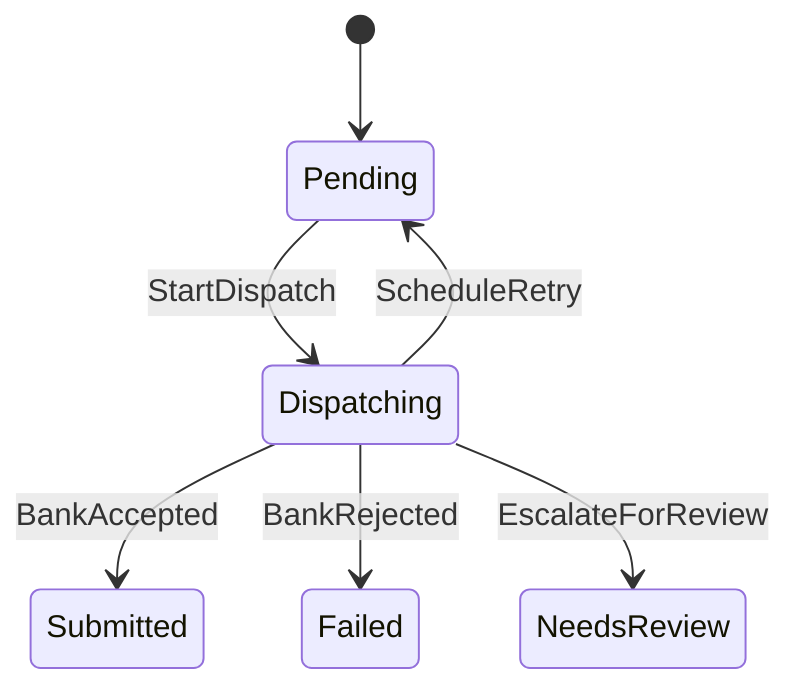
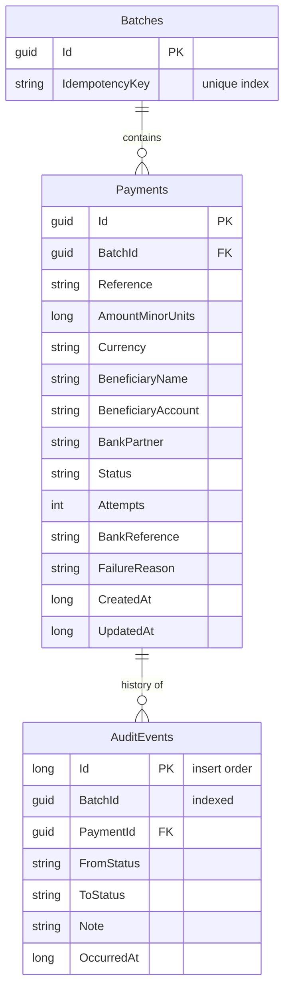
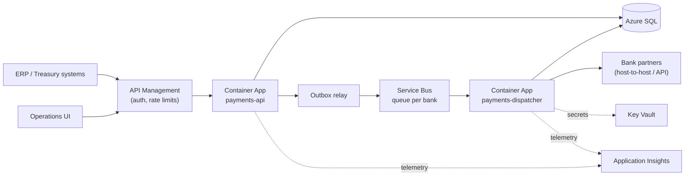

# Payment Batch Service: Architecture

This document explains what the service does, how it is built, the decisions behind it, and what it would take to run it in production on Azure. It is written for an engineer who has not seen the code and wants to start contributing.

Related: [README](../README.md) (build, run, test) · [Backlog](BACKLOG.md) (delivered and future work items)

## 1. The problem

Corporate treasury teams send hundreds of outbound payments on the same business day (vendor payments, inter-company transfers, loan repayments) through several banking partners. Today this is manual and error-prone.

The service accepts a **batch** of payments, validates it, sends each payment to its bank, and tracks every payment to a final outcome, with a full audit trail.

Three things are non-negotiable:

| Requirement | What it means here |
|---|---|
| **Correctness** | A payment is never sent twice and never sent for the wrong amount. |
| **Auditability** | Every status change is recorded: from, to, why and when. |
| **Precision** | Amounts are exact. No floating point and no rounding, ever. |

## 2. Scope

The brief asks for a meaningful slice in 4-6 hours. I chose a slice that runs **end to end** and covers the hard correctness problems, and documented the rest.

**Built**
- Idempotent batch submission over HTTP with whole-batch validation, and exact money handling.
- A payment state machine (Stateless NuGet package) with every change audited, stored with EF Core + SQLite.
- A background dispatcher that sends payments to a simulated bank, retries safely and escalates unknown outcomes.
- Batch status and audit trail over HTTP, Swagger, and 60 automated tests.

**Not built (see [Backlog](BACKLOG.md)):** authentication, multiple workers, real bank formats, settlement tracking, an operations UI, sanctions screening, Azure deployment and more. Each is listed with the reason it matters and roughly when it should be done.

## 3. System overview

Four projects with dependencies pointing inwards: **Core** (domain, state machine, submission and dispatch logic, interfaces) has no dependency on HTTP, EF Core or the bank; **Infrastructure** implements storage and the simulated bank; **Api** hosts the endpoints and the worker. See the [README](../README.md#project-layout) for the layout.

## 4. How a batch flows

**The lost-reply case** matters most: the bank executes the payment but its reply is lost. The retry carries the same idempotency key, so the bank returns the original reference instead of paying again; a test proves it executes once.

## 5. Domain model

| Model | Purpose |
|---|---|
| `PaymentBatch` | Idempotency key and its payments; accepted whole or not at all. |
| `Payment` | Amount (`Money`), beneficiary, bank partner, status, attempts, bank reference, failure reason. |
| `AuditEvent` | One append-only row per status change. |

### Payment state machine

Generated from the code with `PaymentStateMachine.ToMermaidDiagram()`; re-run it when transitions change.

| Status | Meaning |
|---|---|
| **Pending** | Waiting to be sent or retried |
| **Dispatching** | Being sent; the bank call may be in flight |
| **Submitted** | Bank accepted the instruction (not yet settled). Final |
| **Failed** | Bank rejected it; no money moved. Final |
| **NeedsReview** | Retries ran out, outcome unknown; a person checks with the bank. Final |

Anything not permitted throws a `DomainException` and writes no audit event.

**Batch status** is derived: **Processing** while any payment is Pending or Dispatching, then **Completed** if all were Submitted, otherwise **CompletedWithFailures**.

**Production extension.** Banks confirm later through pain.002 status reports and camt.053 statements, adding `Submitted → Settled | Returned`, plus `NeedsReview → Submitted | Failed` for operator resolution (PAY-26, PAY-29).

## 6. Key decisions and trade-offs

### ADR-1: Money is an integer number of minor units
- **Decision.** `Money` is a `long` of minor units plus a currency. "10.005" USD is rejected, never rounded; currencies never mix; amounts travel as JSON strings.
- **Trade-off.** Conversion happens at the edges; the currency list is hard-coded here (reference data in production).

### ADR-2: Payment lifecycle is an explicit state machine (Stateless NuGet package)
- **Decision.** Allowed transitions live in `PaymentStateMachine`. Status has a private setter and every change goes through one `Fire` method that also writes the audit event, so illegal changes are impossible and every change is audited.
- **Trade-off.** One small dependency, versus hand-written checks spread across methods.

### ADR-3: Idempotent submission, enforced by the database
- **Decision.** `POST /batches` requires an `Idempotency-Key`. A repeat returns the original batch (200); a unique index guarantees one batch per key even under concurrent requests.
- **Trade-off.** The same key with a different body also returns the original batch; production rejects it with 422 (PAY-22).

### ADR-4: Whole-batch validation
- **Decision.** All problems are reported at once (`payments[3].amount`) and nothing is saved if anything is wrong, because accepting half a payroll creates a reconciliation problem.
- **Trade-off.** One bad row blocks the batch; failures *after* acceptance are handled per payment.

### ADR-5: Safe dispatch: save first, and a timeout is never a failure
- **Decision.** Save Dispatching before calling the bank. Rejection → Failed. Timeout → retry with the same idempotency key, then NeedsReview after 3 attempts, because we don't know whether the money moved and Failed would invite a duplicate resubmission.
- **Trade-off.** No backoff (PAY-27); a crash leaves a payment in Dispatching until leases exist (PAY-18).

### ADR-6: Polling the database now, events later
- **Decision.** The worker polls the Payments table every 2 seconds. Status and "needs sending" are the same row in one transaction, so there is no dual-write problem and no broker to run.
- **Later.** Transactional outbox + Azure Service Bus (PAY-24); consumers are already idempotent, so at-least-once delivery is safe.

### ADR-7: Dispatch worker runs inside the API process (for now)
- **Decision.** One process, so one F5 runs everything, and **SQLite is a single physical file** that only one process writes to (no cross-process file locks).
- **Trade-off.** Only one instance can run, API and dispatch can't scale separately, and the public process would hold bank credentials. Production: separate `payments-api` and `payments-dispatcher` deployables on Azure SQL.

### ADR-8: Storage behind repository interfaces; EF Core with SQLite
- **Decision.** Core only sees repository interfaces, so swapping to Azure SQL is a provider and connection-string change. SQLite needs no setup.
- **Trade-off.** Schema via `EnsureCreated()`; production uses migrations (PAY-20).

### ADR-9: HTTP API now, file drop documented
- **Decision.** HTTP makes idempotency, validation errors and status codes explicit and is easy to test.
- **Later.** A file adapter (pain.001 or CSV over SFTP or Blob Storage) would reuse the same submission flow. Not in the current backlog.

## 7. Data model and storage

- **Amounts** are integers with a currency column, so the database cannot introduce rounding either.
- **Audit events** are insert-only, ordered by a database-assigned `Id`, and saved in the **same transaction** as the status change, so the trail cannot disagree with the current state.

## 8. Failure, concurrency and consistency

| Situation | What happens |
|---|---|
| Client resends the same batch | Same idempotency key → original batch returned, nothing duplicated |
| Two identical submits at the same instant | Unique index lets one insert win; the other returns the winner's batch |
| Invalid batch | 400 with every problem listed; nothing saved |
| Bank rejects | Payment → Failed with the bank's reason |
| Bank times out / network error | Retry with the same key; after 3 attempts → NeedsReview, never Failed |
| Bank accepted but the reply was lost | Retry with the same key returns the original reference; executed once |
| Process crashes during a bank call | Payment stays in Dispatching (saved before the call), so it is visible rather than silently resent. Reclaiming it automatically needs leases (PAY-18). |
| Worker loop throws | Logged; the next tick tries again; the API keeps serving |
| Illegal status change attempted | `DomainException`; nothing saved, nothing audited |

**Consistency.** Every status change and its audit event, and every new batch with its payments, are written in one transaction; batch status is calculated, so nothing can drift.

**Concurrency.** Submissions are safe (unique index). Dispatch assumes **one worker**: two could pick up the same Pending payment. The bank's idempotency key would still prevent a double payment, but production adds an atomic lease claim (PAY-18) and a `Version` check (PAY-19) so exactly one worker owns a payment.

## 9. Observability and operations

**Today**
- Structured logs from the worker: one line per payment with payment id, reference, batch id, status and attempt number.
- Every status change is in the audit trail and visible through `GET /batches/{id}`.
- Errors are returned as standard problem details (RFC 9457).

**Production (PAY-23)**
- **Tracing and metrics:** OpenTelemetry to Application Insights with a client correlation id; payments by status, dispatch latency and error rate per bank, age of the oldest Pending payment, NeedsReview count.
- **Alerts:** any NeedsReview payment; oldest Pending older than N minutes; a bank's error rate above threshold; Dispatching longer than the lease. Plus liveness and readiness health checks.
- **Runbook:** for NeedsReview or stuck Dispatching, confirm with the bank using the payment id (our idempotency key) and resolve it through the operations UI (PAY-29).

## 10. Security and authentication

Not implemented; the plan:
- **Identity.** Microsoft Entra ID or Okta. ERP systems call the API with the OAuth 2.0 client-credentials flow; people use the operations UI with interactive sign-in.
- **Authorisation.** Roles such as `batch.submit`, `batch.read` and `payment.resolve` (operators), enforced with ASP.NET Core policies.
- **Audit.** The authenticated caller is recorded as the actor on every audit event.
- **Secrets.** Bank credentials in Key Vault, readable only by the dispatcher's managed identity.
- **Data and network.** TLS everywhere, encryption at rest, account numbers masked in logs; the API sits behind API Management with rate limiting, and the dispatcher has no public endpoint.

## 11. Taking it to production

The prioritised list, with reasons, is in the [Backlog](BACKLOG.md#future-work):

1. **Before handling real money:** leases and optimistic concurrency, Azure SQL, authentication, request-hash check on idempotency keys, observability, sanctions screening, dispatch settings from configuration (PAY-18 to PAY-23, PAY-31, PAY-34).
2. **To run at scale:** outbox + Service Bus with a separate dispatcher, real bank adapters, settlement tracking and reconciliation, backoff and cut-off calendars (PAY-24 to PAY-27).
3. **Product growth:** payment operations UI (PAY-29).

## 12. Deploying on Azure

| Concern | Choice |
|---|---|
| Compute | **Azure Container Apps**: `payments-api` scales on requests, `payments-dispatcher` (no ingress) scales on queue length. AKS if the platform already uses it. |
| Database | **Azure SQL**, zone-redundant, point-in-time restore; migrations run in the pipeline. |
| Messaging | **Azure Service Bus**, a queue per bank partner, monitored dead-letter queue. |
| Secrets | **Key Vault** accessed with managed identities; no connection strings in config. |
| Telemetry | **Application Insights** through OpenTelemetry; dashboards and alerts as above. |
| Edge | **API Management** for Entra ID or Okta token validation, rate limiting and versioning. |
| CI/CD | GitHub Actions: build, test, image to Container Registry, deploy to staging, smoke test, promote (blue/green). Bicep for infrastructure. |
| Resilience | Replicas across availability zones (dispatcher once leases exist, PAY-18); geo-replicated SQL for disaster recovery. |

## 13. Assumptions

Listed in the [README](../README.md#assumptions). The ones that shape the design: a single instance runs at a time (ADR-7), and **Submitted** means the bank accepted the instruction, not that the money has settled.

## 14. How AI was used

See [How I used AI](../README.md#how-i-used-ai) in the README for the full account. In short, I used Claude as an assisting tool, a helping hand alongside me. I set how the work was planned and run, and the design decisions and trade-offs are mine.
