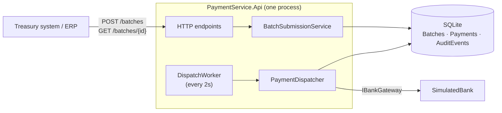
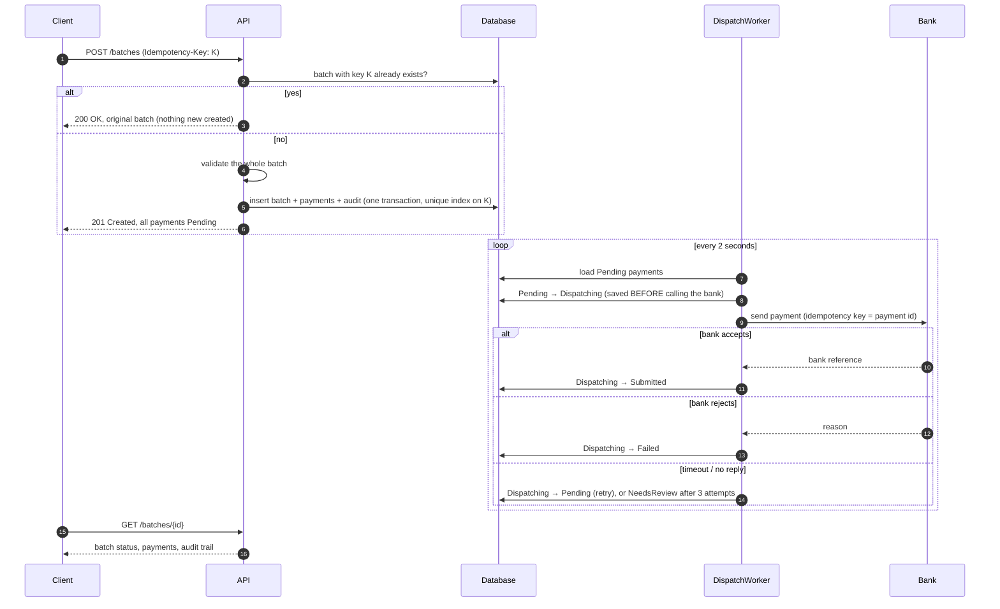
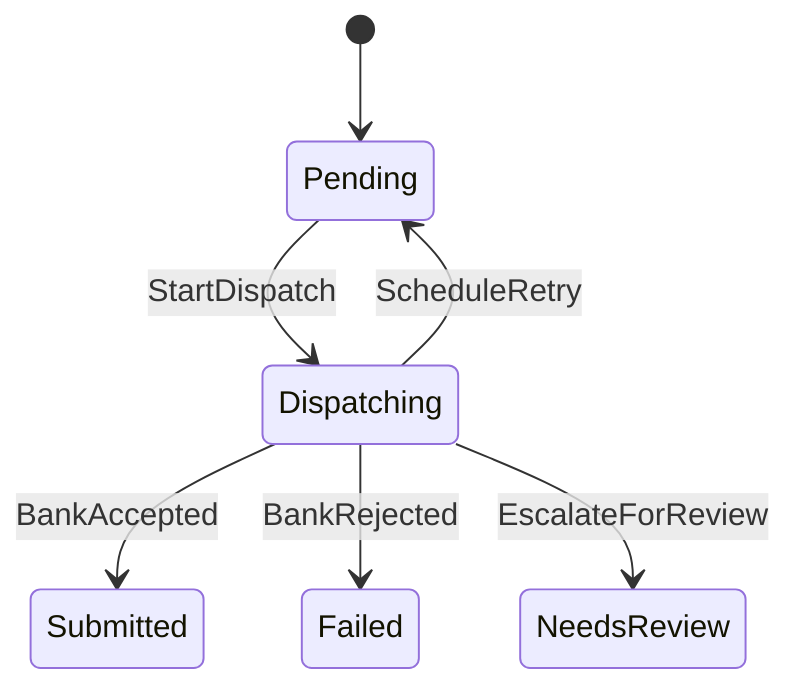
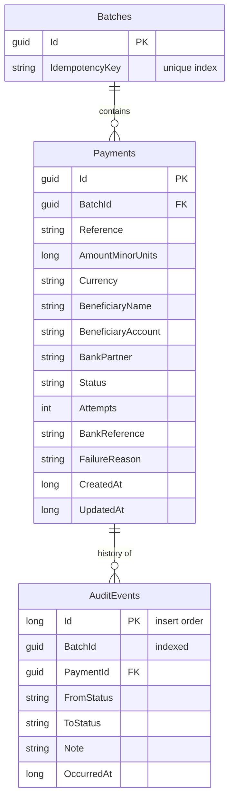
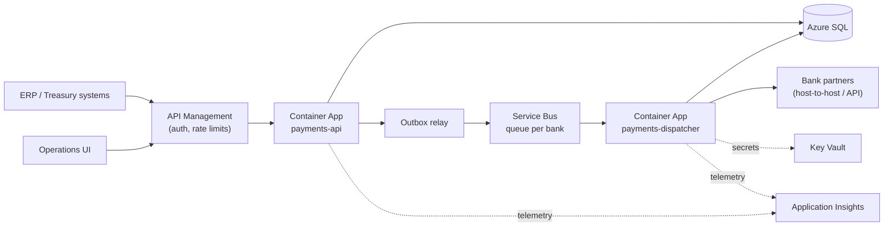

# Payment Batch Service — Architecture

This document explains what the service does, how it is built, the decisions behind it, and what it would take to run it in production on Azure. It is written for an engineer who has not seen the code and wants to start contributing.

Related: [README](../README.md) (build, run, test) · [Backlog](BACKLOG.md) (delivered and future work items)

---

## 1. The problem

Corporate treasury teams send hundreds of outbound payments on the same business day (vendor payments, inter-company transfers, loan repayments) through several banking partners. Today this is manual and error-prone.

The service accepts a **batch** of payments, validates it, sends each payment to its bank, and tracks every payment to a final outcome, with a full audit trail.

Three things are non-negotiable:

| Requirement | What it means here |
|---|---|
| **Correctness** | A payment is never sent twice and never sent for the wrong amount. |
| **Auditability** | Every status change is recorded: from, to, why and when. |
| **Precision** | Amounts are exact. No floating point and no rounding, ever. |

## 2. Scope

The brief asks for a meaningful slice in 4–6 hours. I chose a slice that runs **end to end** and covers the hard correctness problems, and documented the rest.

**Built**
- Submit a batch over HTTP, with an idempotency key and whole-batch validation.
- Exact money handling (minor units, ISO 4217 currencies).
- A payment state machine (Stateless) where every change is audited.
- Persistence with EF Core + SQLite behind repository interfaces.
- A background dispatcher that sends payments to a simulated bank, retries safely, and escalates unknown outcomes to a person.
- Batch status and audit trail over HTTP; Swagger UI for local use.
- 60 automated tests (domain, persistence against real SQLite, submission, dispatch).

**Not built (see [Backlog](BACKLOG.md))** — authentication, multiple workers, real bank formats, settlement tracking, approvals, an operations UI, Azure deployment and more. Each is listed with the reason it matters and roughly when it should be done.

## 3. System overview

The code is split into four projects. Dependencies point inwards: Core knows nothing about HTTP, EF Core or the bank.

| Project | Contains | Depends on |
|---|---|---|
| `PaymentService.Core` | Domain model, state machine, validation, submission and dispatch logic, interfaces (`IPaymentBatchRepository`, `IPaymentRepository`, `IBankGateway`) | Stateless only |
| `PaymentService.Infrastructure` | EF Core `DbContext`, repositories, `SimulatedBank` | Core, EF Core |
| `PaymentService.Api` | Minimal API endpoints, `DispatchWorker`, startup | Core, Infrastructure |
| `PaymentService.Tests` | xUnit tests | All of the above |

## 4. How a batch flows

**The lost-reply case** is the one that matters most. If the bank executes a payment but its reply is lost, we see a timeout. The retry carries the **same idempotency key**, so the bank recognises it and returns the original reference instead of paying again. The simulated bank reproduces this (account numbers ending in `LOSTREPLY`), and a test proves the bank executes the payment exactly once.

## 5. Domain model

| Model | Purpose |
|---|---|
| `PaymentBatch` | Idempotency key and its payments. Accepted as a whole or not at all. Its status is **calculated** from its payments. |
| `Payment` | Reference, amount, beneficiary, bank partner, status, attempts, bank reference, failure reason. Status changes only through its own methods. |
| `Money` / `Currency` | Exact amount in minor units (1250.50 USD is `125050`) plus an ISO 4217 currency with its decimal places (USD 2, JPY 0, BHD 3). |
| `Beneficiary` | Name and account number. |
| `AuditEvent` | One row per status change: from, to, note, time. Append-only. |

### Payment state machine

Generated from the configured `PaymentStateMachine` (`PaymentStateMachine.ToMermaidDiagram()`), so the diagram cannot drift from the code:

| Status | Meaning |
|---|---|
| **Pending** | Waiting to be sent (first attempt or a scheduled retry). |
| **Dispatching** | A worker has started sending it; the bank call may be in flight. |
| **Submitted** | The bank **accepted the instruction** and returned its reference. This is not the same as settled (see below). Final for this service. |
| **Failed** | The bank definitively rejected it. No money moved. Final. |
| **NeedsReview** | Retries ran out and the outcome is unknown. A person must check with the bank. Final for the service. |

Anything not permitted is rejected with a `DomainException` (for example, a Pending payment cannot be marked Submitted), and a rejected change writes no audit event.

**Batch status** is derived: **Processing** while any payment is Pending or Dispatching, then **Completed** if all were Submitted, otherwise **CompletedWithFailures**.

**Production extension.** Banks confirm in stages through ISO 20022 status reports (pain.002) and statements (camt.053). The state machine would grow `Submitted → Settled` and `Submitted → Returned` (a payment can still bounce after acceptance), plus `NeedsReview → Submitted | Failed` for manual resolution by an operator. See PAY-26 and PAY-29.

## 6. Key decisions and trade-offs

### ADR-1: Money is an integer number of minor units
- **Decision.** `Money` stores a `long` of minor units plus a `Currency`. Parsing rejects anything the currency cannot represent ("10.005" USD is an error, never rounded), as well as signs, separators and exponents. Adding different currencies throws.
- **Why.** `double` cannot represent 0.10 exactly. A bare `decimal` allows 10.005 USD, which no bank can settle. Making precision part of the type removes a whole class of bugs.
- **Also.** Amounts travel as JSON **strings** (`"1250.50"`), because many JSON parsers read numbers as floating point.
- **Trade-off.** Callers convert at the edges, and the supported currency list is a hard-coded table here (reference data in production).

### ADR-2: Payment lifecycle is an explicit state machine (Stateless)
- **Decision.** All allowed transitions are configured in one place, `PaymentStateMachine`, using the Stateless library. `Payment.Status` has a private setter. Every change goes through one private `Fire` method, which fires the trigger and then writes the audit event.
- **Why.** Illegal transitions are impossible, not just discouraged. Every change is audited because there is no other path to change status. The configuration doubles as documentation and generates the diagram above.
- **Alternatives.** Hand-written `if` checks in each method work but spread the rules around. A service mutating plain data classes cannot stop other code from setting `Status` directly.
- **Trade-off.** One small dependency; the machine is rebuilt lazily for entities loaded from the database.

### ADR-3: Batch status is calculated, never stored
- **Why.** A stored batch status would have to be updated by every payment change, turning the batch row into a hot spot and creating a second source of truth that can drift.
- **Trade-off.** Reading the status needs the payments. At large scale a read model or materialised summary would be added.

### ADR-4: Idempotent submission, enforced by the database
- **Decision.** `POST /batches` requires an `Idempotency-Key` header. A repeated key returns the original batch (200) instead of creating a new one (201). A **unique index** on the key, not a check in code, guarantees one batch per key even when two identical requests arrive at the same moment; the loser of the race returns the winner's batch.
- **Why.** Clients retry after timeouts. Without this, a retry would submit the whole payment run twice.
- **Known gap.** Reusing a key with a *different* body currently returns the original batch. Production should store a hash of the request and reject a mismatch with 422 (PAY-22).

### ADR-5: Whole-batch validation
- **Decision.** Every payment is validated and **all** problems are reported at once, with paths such as `payments[3].amount`. If anything is wrong, nothing is saved.
- **Why.** Treasury teams fix the file and resubmit. Accepting half a payroll and rejecting the rest creates a reconciliation problem.
- **Distinction.** *Validation* failures reject the batch. *Execution* failures after acceptance (bank rejection, timeout) are handled per payment.

### ADR-6: A timeout is never a failure — retry with the same key, then escalate
- **Decision.** A definitive bank rejection → **Failed**. A timeout or network error → **retry** (back to Pending) with the **same idempotency key**; after 3 attempts → **NeedsReview**.
- **Why.** After a timeout we do not know whether the money moved. Marking it Failed invites someone to resubmit, which is how duplicate payments happen. Retrying is safe because the bank de-duplicates on the key, and a person resolves what retries cannot.
- **Trade-off.** Retries happen on the next worker tick (about 2 seconds), with no backoff. Production needs exponential backoff, a `NextAttemptAt` column and per-bank policies (PAY-27).

### ADR-7: Save "Dispatching" before calling the bank
- **Why.** If the process crashes during the bank call, the database shows the payment was being sent, rather than Pending as if nothing had happened, which would cause a blind resend.
- **Known gap.** With a single worker, a payment left in Dispatching after a crash stays there until someone looks. Production adds a lease (`LeaseOwner`, `LeaseExpiresAt`) so another worker can reclaim it safely with the same idempotency key (PAY-18).

### ADR-8: Polling the database now, events later
- **Decision.** The worker polls the Payments table every 2 seconds. The table is the queue.
- **Why.** The status change and "this needs sending" are the same row in the same transaction, so there is no dual-write problem (saving to the database *and* publishing to a broker, where one can succeed and the other fail). It is crash-safe, and it runs with no broker.
- **Production.** Event-driven with a **transactional outbox** feeding **Azure Service Bus** (a queue or session per bank partner), with consumers that scale out (PAY-24). The consumers are already idempotent: the state machine rejects a second `StartDispatch`, and the bank de-duplicates on the key, so at-least-once delivery is harmless. Bank confirmations (pain.002, webhooks) also arrive as events.

### ADR-9: Dispatch worker runs inside the API process (for now)
- **Decision.** `DispatchWorker` is a `BackgroundService` hosted alongside the API.
- **Why.** One F5 or `dotnet run` starts the whole system. And **SQLite is a single physical file**: with one process writing, there are no cross-process file locks ("database is locked"), no shared paths and no extra configuration. SQLite serialises writes at the file level, which suits one process but is the wrong foundation for an API and a worker scaling separately.
- **Trade-offs accepted.**
  - API and dispatch cannot scale independently.
  - A slow bank shares resources with the API.
  - The process serving public HTTP would hold bank credentials.
  - The file lives on the host's local disk: it is not shared between instances and does not survive a replaced container. **Only one instance can run.**
- **Production.** Two deployables from the same code: `payments-api` (no bank secrets) and `payments-dispatcher` (bank credentials from Key Vault), both on Azure SQL, scaled independently.
- **Seam.** All dispatch logic is in `PaymentDispatcher` (Core). Splitting means one new Worker Service project hosting the existing `DispatchWorker`.

### ADR-10: Storage behind repository interfaces; EF Core with SQLite
- **Decision.** Core depends only on `IPaymentBatchRepository` and `IPaymentRepository`. Infrastructure implements them with EF Core and SQLite.
- **Why.** The brief requires a swappable data layer. SQLite needs no setup, so a reviewer can clone and run. Moving to Azure SQL means changing the EF provider and connection string, with no change to Core.
- **Trade-offs.** SQLite cannot compare `DateTimeOffset`, so times are stored as sortable numbers. The schema is created with `EnsureCreated()` at startup; production uses EF Core migrations (PAY-20).

### ADR-11: HTTP API now, file drop documented
- **Decision.** Batches arrive over HTTP.
- **Why.** It is easier to test and review, and it makes idempotency, validation errors and status codes explicit.
- **Production.** Many treasuries submit ISO 20022 pain.001 or CSV files over SFTP or Blob Storage. A file-ingestion adapter would parse the file into the same `SubmitBatchRequest` and reuse validation, idempotency (keyed on a hash of the file) and dispatch (PAY-30).

## 7. Data model and storage

- **Amounts** are integers (`AmountMinorUnits`) with a currency column, so the database cannot introduce rounding either.
- **Status** is stored as text, which is readable in the database and safe if the enum is reordered.
- **Audit events** are only ever inserted. The database assigns `Id` in insert order, which gives the trail its order even when events share a timestamp. Each status change and its audit event are saved in **one `SaveChanges` call, which is one transaction**, so the trail cannot disagree with the current state.
- **Indexes.** Unique on `Batches.IdempotencyKey`; `Payments.BatchId`; `AuditEvents.BatchId`. Production adds `Payments(Status, CreatedAt)` for the dispatcher query and indexes for the search API.
- **Retention.** Payment and audit data in financial services is typically kept for years. Production would set a retention policy and archive old batches to cheaper storage, never delete them.

## 8. Failure, concurrency and consistency

| Situation | What happens |
|---|---|
| Client resends the same batch | Same idempotency key → original batch returned, nothing duplicated |
| Two identical submits at the same instant | Unique index lets one insert win; the other returns the winner's batch |
| Invalid batch | 400 with every problem listed; nothing saved |
| Bank rejects | Payment → Failed with the bank's reason |
| Bank times out / network error | Retry with the same key; after 3 attempts → NeedsReview, never Failed |
| Bank accepted but the reply was lost | Retry with the same key returns the original reference; executed once |
| Process crashes during a bank call | Payment stays in Dispatching (saved before the call), so it is visible rather than silently resent. Reclaiming it automatically needs leases (PAY-18). |
| Worker loop throws | Logged; the next tick tries again; the API keeps serving |
| Illegal status change attempted | `DomainException`; nothing saved, nothing audited |

**Consistency rules**
- A payment's status and its audit event are written in the same transaction.
- A batch, its payments and their first audit events are written in the same transaction.
- Batch status is calculated from payments, so there is no second copy to drift.

**Concurrency today, and what changes in production**
- *Submissions* are safe under concurrency (unique index).
- *Dispatch* assumes **one worker**. Running two today could make both pick up the same Pending payment. The bank's idempotency key would still prevent a double payment, but the audit trail would be confusing. Production uses:
  - **Leases.** An atomic `UPDATE … SET Status='Dispatching', LeaseOwner=@me, LeaseExpiresAt=@t WHERE Id=@id AND (Status='Pending' OR LeaseExpiresAt < now)`, so exactly one worker wins (PAY-18).
  - **Optimistic concurrency.** A `Version` column on `Payments`, so a worker whose lease expired cannot overwrite a newer result (PAY-19).

## 9. Observability and operations

**Today**
- Structured logs from the worker: one line per payment with payment id, reference, batch id, status and attempt number.
- Every status change is in the audit trail and visible through `GET /batches/{id}`.
- Errors are returned as standard problem details (RFC 9457).

**Production (PAY-23)**
- **Tracing.** OpenTelemetry traces from HTTP request to database to bank call, with a correlation id accepted from the client and stamped on logs and audit events. Exported to Application Insights.
- **Metrics**
  - Payments by status
  - Dispatch latency per bank
  - Bank error rate per bank
  - Retries per payment
  - Age of the oldest Pending payment
  - Count of NeedsReview payments
- **Alerts**
  - Any NeedsReview payment (page during business hours)
  - Oldest Pending payment older than N minutes (dispatcher stuck)
  - A bank's error rate above a threshold
  - Payments in Dispatching for longer than the lease
- **Health checks.** Liveness, and readiness including a database check, for the container platform.
- **Runbooks**
  - *NeedsReview:* confirm with the bank using the payment id (our idempotency key) and resolve through the operations UI (PAY-29).
  - *Stuck Dispatching:* the same check, then reclaim.

## 10. Security and authentication

Authentication is not implemented (the brief says to document it). The plan:
- **Identity.** Microsoft Entra ID. ERP systems call the API with the OAuth 2.0 client-credentials flow; people use the operations UI with interactive sign-in.
- **Authorisation.** Roles such as `batch.submit`, `batch.read`, `payment.resolve` (operators) and `payment.approve` (approvers), enforced with ASP.NET Core policies. Batches are scoped to the caller's organisation (multi-tenancy, PAY-33).
- **Audit.** The authenticated principal becomes the actor on every audit event (today the actor is implicit).
- **Secrets.** Bank credentials and certificates in Azure Key Vault, readable only by the dispatcher's managed identity. Nothing secret in config files.
- **Data.** TLS everywhere; Azure SQL with encryption at rest; beneficiary account numbers masked in logs.
- **Network.** API behind Azure API Management or Front Door with rate limiting; the dispatcher has no public endpoint.

## 11. Taking it to production

The full list is in the [Backlog](BACKLOG.md). In priority order:

1. **Must have before real money:**
   - Authentication and authorisation (PAY-21)
   - Azure SQL with migrations (PAY-20)
   - Leases and optimistic concurrency for multiple workers (PAY-18, PAY-19)
   - Request-hash check on idempotency keys (PAY-22)
   - Observability and alerts (PAY-23)
2. **Needed to run at scale:**
   - Outbox + Service Bus and a separate dispatcher deployable (PAY-24)
   - Real bank adapters (PAY-25)
   - Settlement tracking and reconciliation (PAY-26)
   - Backoff, cut-off times and holiday calendars (PAY-27)
   - Maker-checker approvals (PAY-28)
3. **Product growth:**
   - Operations UI with search (PAY-29)
   - File-drop intake (PAY-30)
   - Sanctions screening (PAY-31)
   - FX (PAY-32)
   - Multi-tenancy (PAY-33)

## 12. Deploying on Azure

| Concern | Choice |
|---|---|
| Compute | **Azure Container Apps.** Two apps from the same image or repo: `payments-api` (HTTP, scales on requests) and `payments-dispatcher` (no ingress, scales on queue length with KEDA). AKS if the platform team already runs Kubernetes. |
| Database | **Azure SQL**, zone-redundant, with point-in-time restore. EF Core migrations run as a pipeline step before the new version starts. |
| Messaging | **Azure Service Bus** (Premium for isolation), a queue or session per bank partner, dead-letter queue monitored. |
| Secrets | **Key Vault** accessed with managed identities; no connection strings in config. |
| Telemetry | **Application Insights** through OpenTelemetry; dashboards and alerts as above. |
| Edge | **API Management** for Entra ID token validation, rate limiting and versioning. |
| CI/CD | GitHub Actions: build, test, container image to Azure Container Registry, deploy to staging, smoke test, then promote to production with revisions (blue/green). Infrastructure as code with Bicep. |
| Resilience | Multiple replicas across availability zones; the dispatcher is safe to run on several replicas once leases are in (PAY-18); geo-replicated SQL for disaster recovery. |

## 13. Assumptions

- One instance of the service runs at a time (see ADR-9).
- All times are UTC. Payments are sent as soon as they are accepted; there are no cut-off times or future execution dates.
- A batch holds between 1 and 1,000 payments; all are validated together.
- Supported currencies are a fixed list (USD, EUR, GBP, CHF, CAD, SGD, INR, JPY, BHD).
- `bankPartner` is free text and the simulated bank serves every partner.
- **Submitted** means the bank accepted the instruction, not that the money has settled.
- The simulated bank keeps its memory of idempotency keys in process, so it resets when the app restarts.
- No authentication; the caller is trusted.

## 14. How AI was used

I used Claude as a pair programmer for scaffolding, test cases and reviewing this document. The design decisions, scope and trade-offs are mine, and I reviewed and adjusted all generated code. Every work item was committed separately so the history shows how the solution was built (see [Backlog](BACKLOG.md)).
